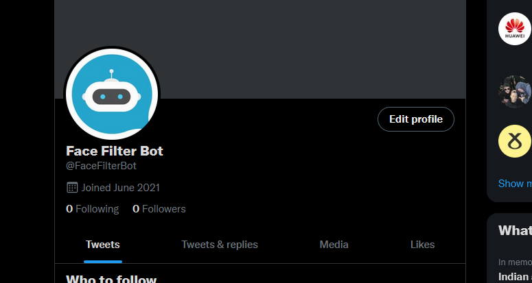

The Twitter Face Filter Bot is a project I decided to undertake the summer of 2021. Its main purpose is to retrieve media from a tweet which mentions the page shown below. When media is retrieved the bot then uses machine learning to place a filter over the face of people in the image currently it places a batman mask over the face of the person in the image.

